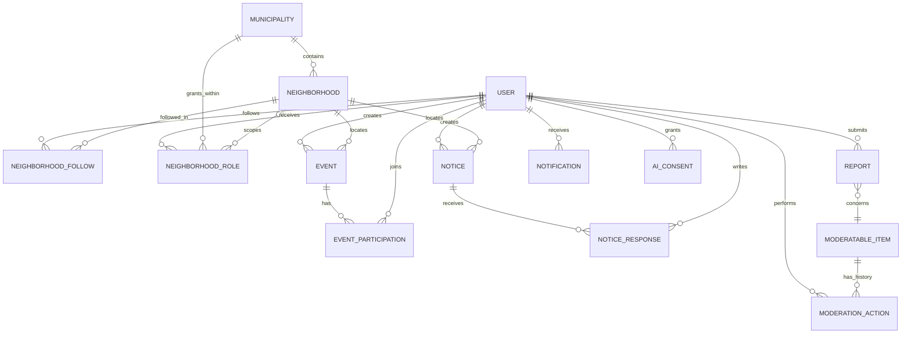

# Modelo conceitual de dados

O modelo abaixo descreve entidades e relações propostas. Ainda não é um esquema de banco aprovado: atributos, retenção e regras de exclusão precisam ser decididos antes da implementação.

## Relações

MODERATABLE_ITEM é uma referência conceitual a um evento, aviso ou resposta; na implementação deve ser modelada de forma que a chave estrangeira e o tipo de conteúdo sejam verificáveis. Não usar uma relação polimórfica sem definir como garantir integridade.

## Entidades e limites

| Entidade | Papel no produto | Campos/regras que precisam ser definidos |
| --- | --- | --- |
| User | Conta e preferências. | Nome de exibição, e-mail, credencial protegida, estado da conta e preferências. Não guardar localização residencial sem necessidade. |
| Municipality | Município e fronteira administrativa. | Nome, identificador oficial se necessário, estado e administradores autorizados. |
| Neighborhood | Unidade de feed e escopo de moderação. | Nome, município, estado ativo/inativo e nomes alternativos de busca. |
| NeighborhoodFollow | Bairros principal e acompanhados pela conta. | Uma relação deve indicar bairro principal sem duplicar acompanhamento. |
| NeighborhoodRole | Designação municipal de moderador ou administrador. | Papel, escopo, concedente, início, revogação/validade e motivo. Verificar no servidor. |
| Event | Atividade comunitária. | Autor, bairro, local, início/fim, limite, custo e estado; política de edição/cancelamento. |
| EventParticipation | Confirmação ou cancelamento de presença. | Restrição única por evento/conta e regra para vagas concorridas. |
| Notice | Aviso ou pedido/oferta de ajuda. | Autor, categoria, bairro, local público, estado e histórico de atualização. |
| NoticeResponse | Resposta ou oferta de colaboração associada a um aviso. | Autor, conteúdo, estado de moderação e data. |
| Report | Denúncia enviada para análise. | Autor protegido, item, motivo, contexto, estado e datas. |
| ModerationAction | Histórico imutável de decisão. | Ator, item, escopo, ação, justificativa, data e pedido/revisão relacionada. |
| Notification | Registro de notificação dentro do produto. | Destinatário, evento que a originou, canal e estado de leitura/entrega. |
| AIConsent | Evidência mínima de consentimento para uma chamada opcional. | Conta, finalidade/versão do aviso de consentimento, data e retirada. Evitar persistir o rascunho enviado sem necessidade. |

## Regras de integridade

Uma publicação pertence a um município por meio de seu bairro. A troca de bairro deve verificar que o bairro está ativo e dentro do município selecionado. Guardar uma linha de designação por bairro autorizado; uma função administrativa municipal pode ter escopo de município, sem bairro específico. A auditoria deve permanecer consultável após desativação de conta ou bairro, de acordo com uma política de retenção ainda a definir.

Este diagrama não especifica tipos de banco, índices, chaves físicas ou política legal de retenção. Decidir isso com a stack e a política de dados antes de criar migrations.
