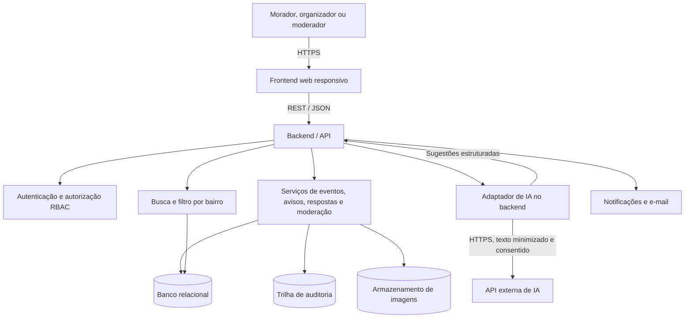

# Visão Geral da Arquitetura do Sistema

## Objetivo arquitetural

O VivaBairro será um site responsivo, com interface mobile-first. A arquitetura separa interface, API, regras de negócio, persistência e integração externa de IA. Essa separação permite testar cada parte e trocar o provedor de IA sem colocar a chave de API no navegador.

## Diagrama de componentes

## Fluxo de uma publicação assistida por IA

1. O usuário preenche título e descrição de um aviso no site.
2. A interface explica o uso opcional da IA e pede consentimento antes do envio.
3. O frontend envia o rascunho ao backend autenticado. A chave do provedor fica apenas no ambiente do servidor.
4. O adaptador remove campos que não são necessários e chama a API externa com limite de tempo e formato de resposta definido.
5. O backend valida a resposta e retorna sugestões de categoria e resumo.
6. O usuário revisa, edita ou descarta as sugestões e confirma a publicação. A publicação manual continua disponível em caso de falha da IA.

A IA não decide se o aviso é verdadeiro, urgente ou seguro, não publica automaticamente e não modera usuários. O backend registra metadados técnicos da chamada sem guardar desnecessariamente o texto enviado ao provedor.

## Responsabilidades das camadas

| Camada | Responsabilidade |
| --- | --- |
| Frontend web | Exibir feed, busca, atividades, avisos, perfil, formulários e estados de carregamento, sucesso e erro. Adaptar navegação a telas compactas e largas. |
| API | Validar entradas, autenticar sessões, aplicar permissões, coordenar serviços e responder em JSON. |
| Serviços de domínio | Aplicar regras de inscrição, status dos avisos, designação territorial e fluxo de moderação. |
| Banco relacional | Persistir contas, bairros, atividades, inscrições, avisos, denúncias, designações e registros de auditoria. |
| Adaptador de IA | Isolar o provedor externo, limitar e validar entradas e respostas e tratar indisponibilidade. |
| Notificações e arquivos | Entregar lembretes e atualizações e guardar imagens opcionais sem expor caminhos internos. |

## Entidades principais

`User`, `Municipality`, `Neighborhood`, `NeighborhoodRole`, `Event`, `EventParticipation`, `Notice`, `NoticeResponse`, `Report`, `ModerationAction`, `Notification` e `AIProcessingConsent`. Relações territoriais e papéis devem ser verificados no backend, não apenas escondidos na interface.

## Tecnologias como hipótese acadêmica

Uma implementação simples pode usar React com TypeScript no frontend, uma API HTTP no backend e PostgreSQL para os dados. A integração de IA deve ficar atrás de uma interface `AIProvider`, permitindo usar um provedor real ou uma resposta simulada na demonstração. A escolha final depende da experiência do grupo e de quais serviços estarão disponíveis; o diagrama descreve responsabilidades e não exige todos os componentes de infraestrutura já na primeira versão.

## Decisões de escopo para o protótipo

Na primeira entrega, banco, e-mail, armazenamento de imagem e chamada de IA podem ser simulados se o tempo ou as credenciais não estiverem disponíveis. O protótipo deve deixar visíveis os estados de sucesso e erro, e não apresentar uma simulação como se fosse integração real. A arquitetura mantém a opção de integração real sem redesenhar os fluxos.
