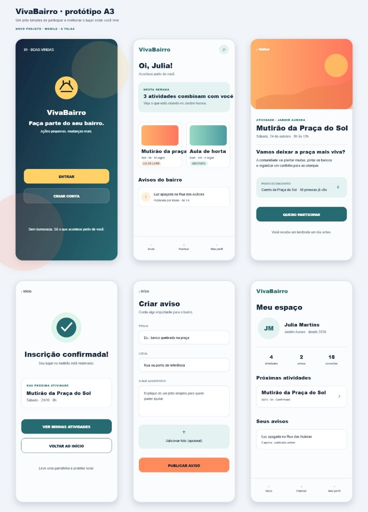

# Protótipo Inicial de Interface (Wireframes / Mockups)

Esta seção apresenta a arquitetura visual e os fluxos de navegação mobile do **VivaBairro (Protótipo A3)**, demonstrando a jornada do usuário em conformidade com as diretrizes de usabilidade, clareza e baixo atrito cognitivo.

---

## Visão Geral das Telas

---

## 1. Tela de Login / Início (Boas-Vindas e Acesso)

* **Propósito:** Apresentação da marca, ambientação do morador e acesso sem barreiras burocráticas.
* **Elementos Visuais:**
  * Identidade visual limpa com ícone comunitário do VivaBairro.
  * Chamada de valor (*Hero copy*): *"Faça parte do seu bairro. Ações pequenas, mudanças reais."*
  * Botões de Ação Primária e Secundária: **Entrar** (login de usuários existentes) e **Criar Conta** (cadastro simplificado).
  * Mensagem de transparência: *"Sem burocracia. Só o que acontece perto de você."*

---

## 2. Tela de Função Principal (Feed do Bairro)

* **Propósito:** Centralizar tudo o que acontece na vizinhança imediata do morador.
* **Elementos Visuais:**
  * Saudação personalizada com identificação do usuário e localização (*"Oi, Julia! Acontece perto de você"*).
  * Busca global no canto superior direito para pesquisa por ruas, termos ou tipos de serviço.
  * Módulo de destaque de atividades em formato de cards visuais (*"Mutirão da praça"*, *"Aula de horta"*).
  * Feed dinâmico de avisos e ocorrências recentes com status e autor.
  * Barra de navegação inferior (*Bottom Navigation*): **Início**, **Publicar (+)** e **Meu Perfil**.

---

## 3. Tela de Ação da IA (Recomendação Contextual e Detalhes da Atividade)

* **Propósito:** Apresentar a atividade sugerida pelo motor de recomendação inteligente com todas as orientações práticas de participação.
* **Mecanismo de IA:** O algoritmo cruza o histórico de participação, categorias de interesse e proximidade territorial para gerar recomendações personalizadas (*"Nesta semana: 3 atividades combinam com você no Jardim Aurora"*).
* **Elementos Visuais:**
  * Banner ilustrativo do evento e tag de categoria (*Atividade • Jardim Aurora*).
  * Título e horário: *"Mutirão da Praça do Sol — Sábado, 24 de outubro • 9h às 12h"*.
  * Descrição do objetivo comunitário: *"Vamos deixar a praça mais viva? A comunidade vai plantar mudas, pintar os bancos e organizar um cantinho para as crianças."*
  * Ponto de encontro e prova social: *"Coreto da Praça do Sol • 18 pessoas já vão"*.
  * Botão de Ação: **Quero Participar** (com aviso de lembrete automático 1 dia antes).

---

## 4. Tela de Resultado / Saída (Confirmação de Inscrição e Feedback)

* **Propósito:** Fornecer feedback imediato de sucesso da ação executada pelo morador.
* **Elementos Visuais:**
  * Ícone de confirmação de sucesso em destaque (*Check verde*).
  * Mensagem clara de retorno: *"Inscrição confirmada! Seu lugar no mutirão está reservado."*
  * Card resumo da próxima atividade agendada com data e horário.
  * Dicas contextuais: *"Leve uma garrafinha e protetor solar."*
  * Botões de navegação rápida: **Ver Minhas Atividades** ou **Voltar ao Início**.

---

## 5. Tela de Criação e Reporte (Publicação de Avisos e Ocorrências)

* **Propósito:** Canal simplificado para o cidadão reportar problemas urbanos, pedidos de ajuda ou avisos locais.
* **Elementos Visuais:**
  * Título e orientação: *"Criar aviso — Conte algo importante para o bairro."*
  * Campo **Título**: *"Ex.: banco quebrado na praça"*.
  * Campo **Local**: *"Rua ou ponto de referência"*.
  * Campo **O que aconteceu?**: Espaço para descrição simples e objetiva.
  * Botão de anexo de foto opcional (*"Adicionar foto"*).
  * Botão de submissão em destaque: **Publicar Aviso**.

---

## 6. Tela de Configurações e Perfil (Meu Espaço)

* **Propósito:** Painel pessoal do morador para gerenciar participações, histórico e preferências.
* **Elementos Visuais:**
  * Avatar com iniciais, nome (*Julia Martins*) e tempo de comunidade (*Jardim Aurora • desde 2025*).
  * Painel de métricas de impacto comunitário: **4 atividades** participadas | **2 avisos** publicados | **18 conexões** locais.
  * Seção **Próximas Atividades**: listagem de eventos com status de confirmação.
  * Seção **Seus Avisos**: listagem de ocorrências criadas pelo usuário para acompanhamento e atualização de status (*"Luz apagada na Rua das Acácias • 3 apoios"*).
