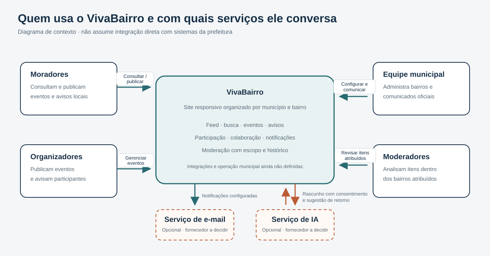
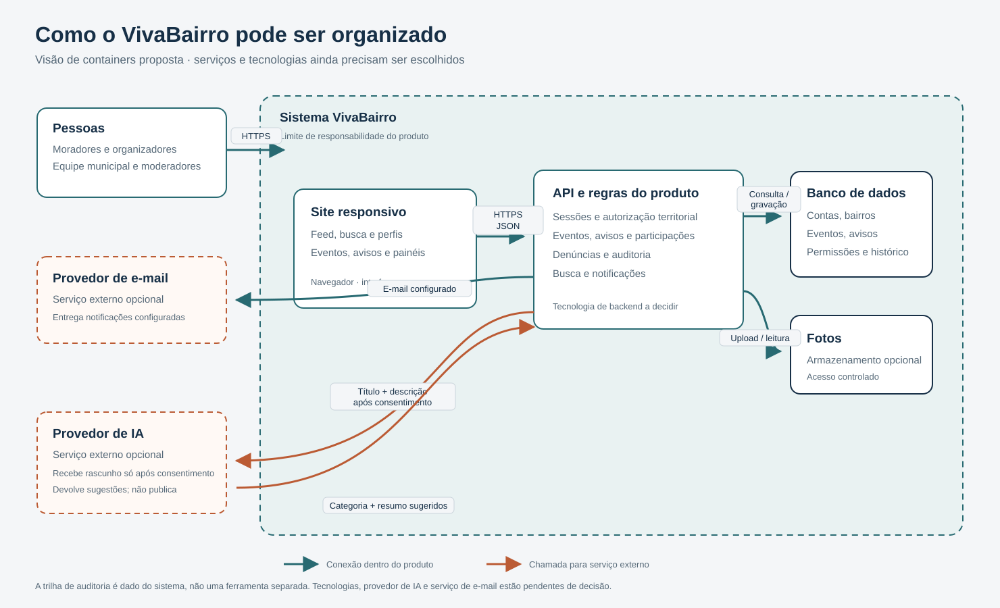
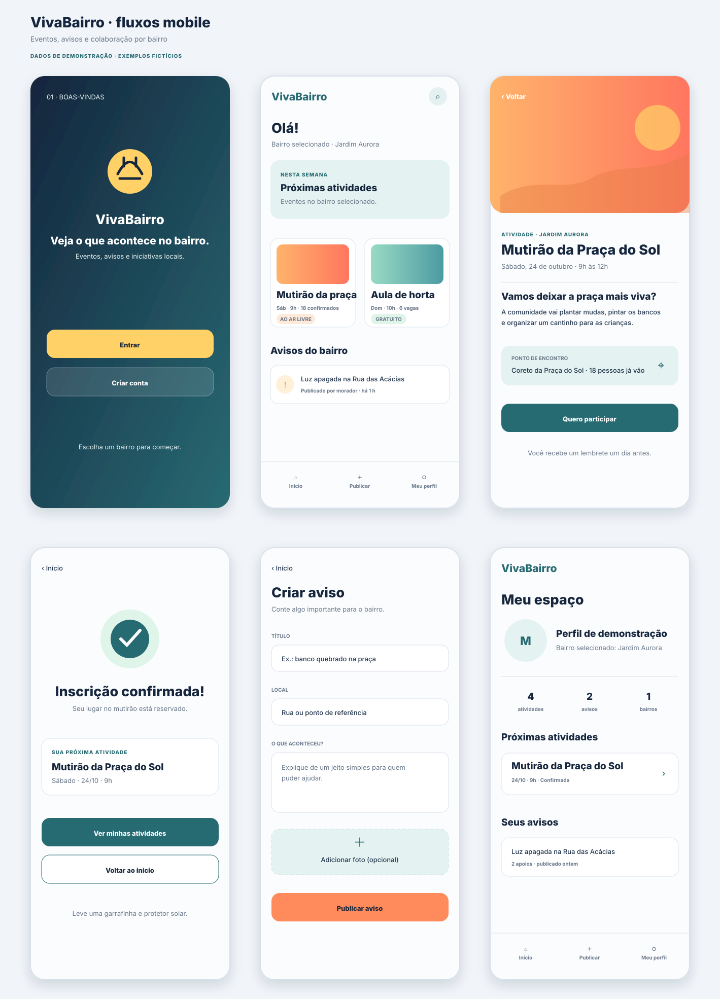
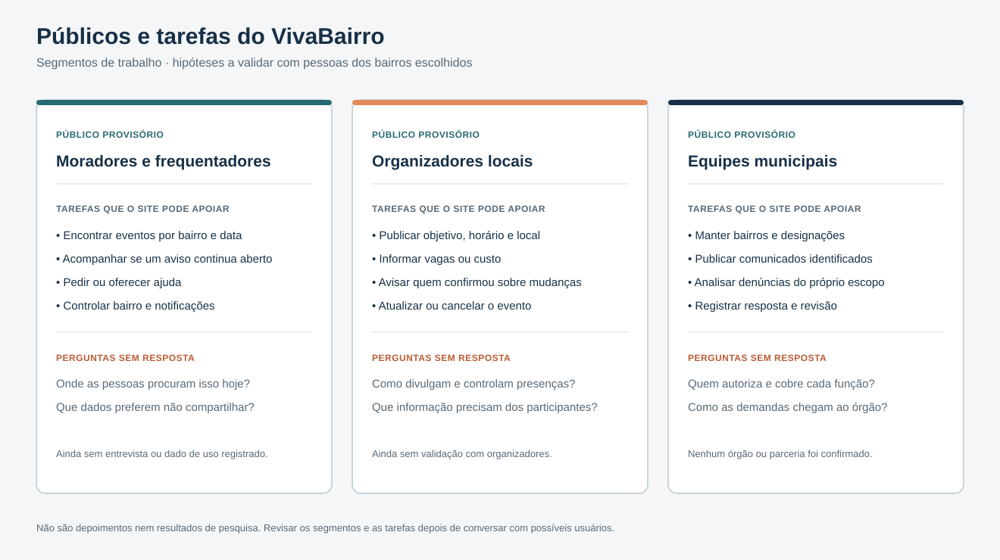
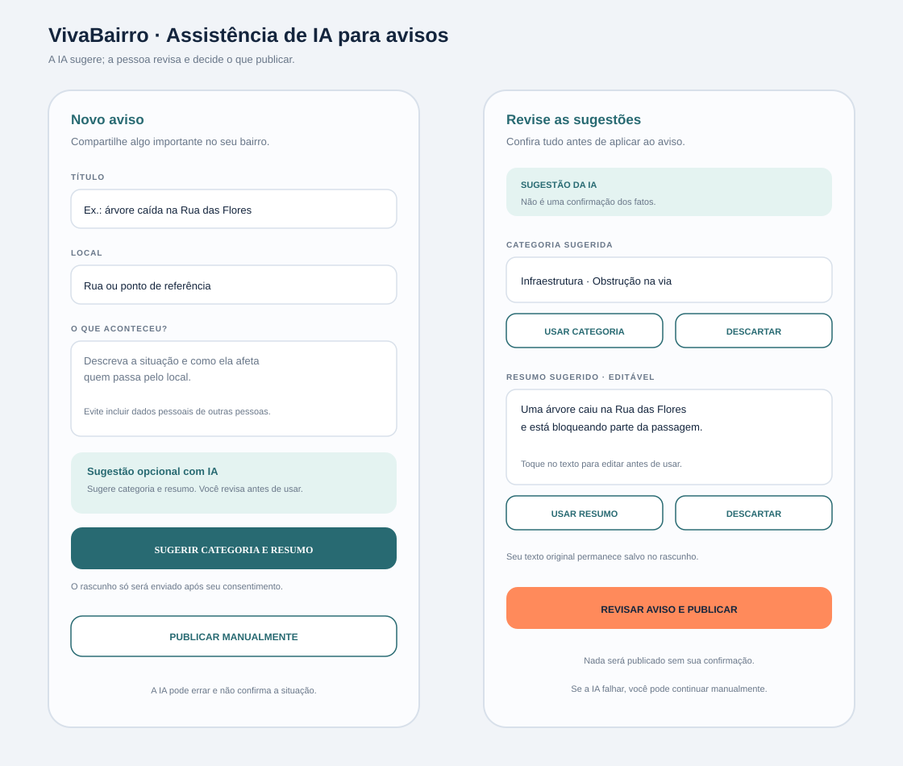
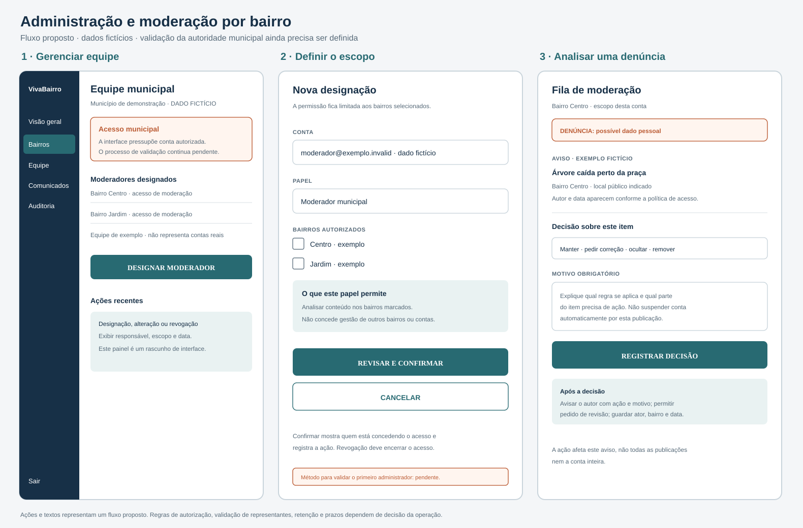

# Sobre o VivaBairro

O VivaBairro é uma proposta de site responsivo para reunir eventos, avisos e pedidos de colaboração organizados por município e bairro. O produto também prevê comunicados municipais identificados e ferramentas de moderação com escopo e histórico.

## Navegue pela documentação

- [Visão do produto e hipóteses](1-visao-geral/visao-produto-lean-canvas.md)
- [Escopo do produto](1-visao-geral/documento-escopo.md)
- [Públicos e tarefas previstas](1-visao-geral/publicos-e-tarefas.md)
- [Requisitos e critérios de verificação](10-requisitos/requisitos-funcionais-nao-funcionais.md)
- [Rastreabilidade entre necessidades, requisitos e interface](10-requisitos/rastreabilidade-usabilidade.md)
- [Arquitetura proposta](8-arquitetura-tecnica/visao-arquitetura.md)
- [Modelo conceitual de dados](8-arquitetura-tecnica/modelo-dados.md)
- [Telas e fluxos](9-prototipo-interface/prototipo-wireframes.md)
- [Papéis, permissões e escopo](6-governanca-moderacao/matriz-permissoes.md)

## Materiais do produto

## Estado atual

A documentação descreve uma solução proposta, não um serviço em operação. Ainda dependem de decisão: município e bairros de referência, validação das contas municipais, equipe e horário de moderação, stack, retenção de dados e provedor de IA. O repositório não registra parceria municipal ou resultado de pesquisa com moradores. Protótipos e integrações simuladas devem ser identificados como tais.
